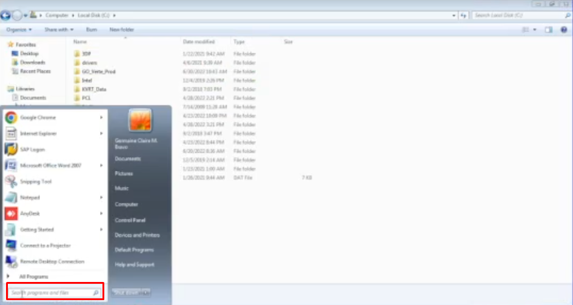
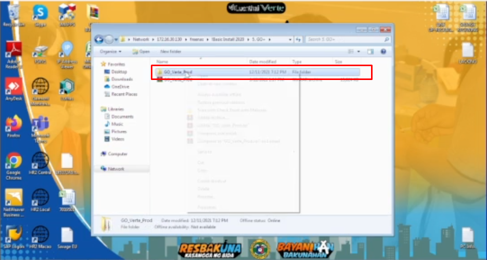

# Title: BROKEN SYSTEM
## Prerequisite:
```
It's better if the requestor provided a screenshot of a pop-up error or notification in their GO+. (OPTIONAL) (RECOMMENDED)
```

## Problem Description:
```
The requestor already have an installed GO+ but fails to run due to unknown reasons
```

## Possible Problem Samples:
1. Microsoft .NET Framework


2. SmartGUIClient is not responding


## Solution: Delete the User's copy of GO+ and re-install GO+

1. Delete user's ***GO+ desktop icon***


2. Delete user's ***GO+ folder*** (either named as GO+ or GO_VERTE_PROD file directory) 


3. Go to Windows ***Search Bar***


4. Type ***run***, and click the ***Run*** program


5. make sure to set ***172.16.30.130*** in the input field and click ***Ok***


6. A pop-up will show up on the screen

    a. Scenario 1: username and password pop-up appears - Login with ***your username and password*** to open ***freenas***
    

    b. Scenario 2: a pop-up with ***freenas*** appears - click the ***freenas*** icon
    


7. Navigate ***!Basic Install 2020 > 5. GO+*** folder directory

8. Copy ***GO_VERTE_PROD*** folder to user's ***Desktop***


9. Open ***GO_VERTE_PROD*** folder and select ***SmartGUINet.Client.Auto.Update***


10. Right click the mouse, navigate ***Send to > Desktop (create shortcut)***


11. In the ***Desktop***, rename the ***SmartGUINet.Client.Auto.Update*** to ***GO+***

12. Open the ***GO+*** program and inform the user to login and observe if the program is working fine

9. If the user says ```It's working fine now``` means you're done!


## Possible New Problems and their solutions:
```
A. 

Problem:
----------------------------

An error has occured while compiling dynamic code:

Metadata file
"C:\Path\To\Users\GO_VERTE_PROD\
PRO_UAS_Functions.ddl" could not be opened -- 'File is corrupt'
```


```
Solution:
----------------------------

1. Delete current GO+ desktop icon and file directory
2. Copy another folder of GO+ from freenas folder directory
3. Do the installation process again
```


