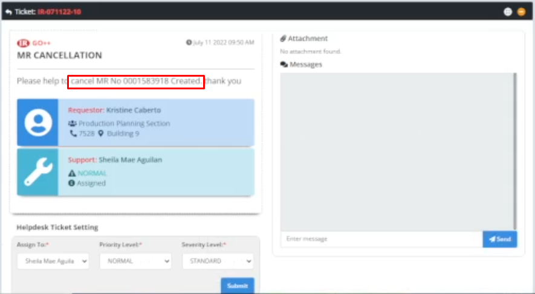

# Title: CANCEL MR
## Prerequisite:
```
The MR Number: 000 + (7 digits) should be indicate in the Ticket description. (REQUIRED)
```

```
It's better if the requestor provided a screenshot of a pop-up error or notification in their GO+. (OPTIONAL)
```

## Problem Description:
```
The requestor wants to cancel MR number that he/she already created.
```



## Why the Requestor asked for it?
```
N/A
```

## Possible Problem Samples:
```
N/A
```

## Solution:

1. Go to ***GO+***

2. Navigate ***Tools > Admin Tools > Locks > Locks Table***


3. Click ***Unlock***


4. An unlock pop-up will appear, tick the ***MR No.*** checkbox in the Reservations fieldset


5. Then, in the input field, type ***000*** then the specified ***MR Number***


6. Click ***Unlock***


7. A confirmation pop-up appears. Click ***Yes***


8. An information pop-up appears. click ***Ok***


9. You're done!


## Possible New Problems and their solutions:
```
N/A
```

