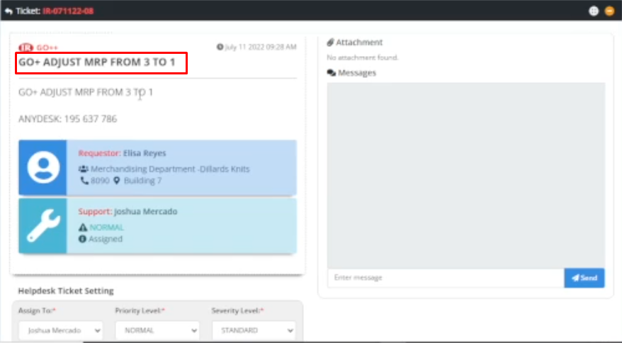
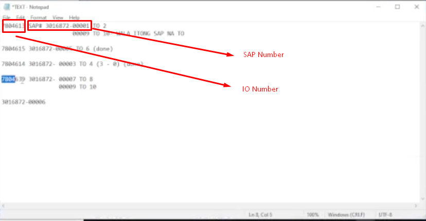
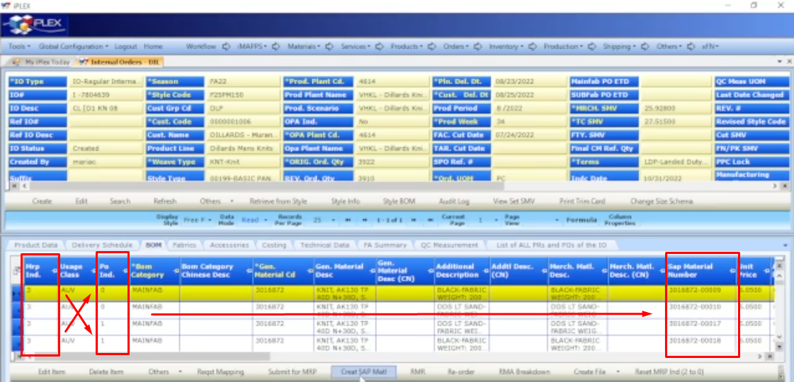
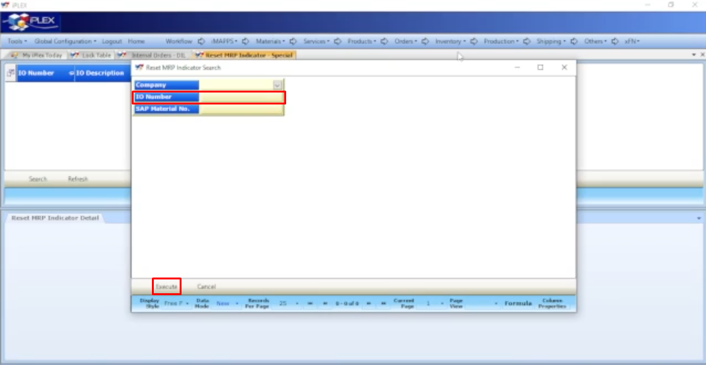

# Title: MRP ADJUSTMENT
## Prerequisite:
```
The requestor should provide both MR Number and their corresponding SAP Material (REQUIRED)
```

```
It's better if the requestor provided a screenshot of a list containing MR Number and their SAP Material (OPTIONAL) (RECOMMENDED)
```

## Problem Description:
```
The requestor wants to adjust MRP.
```





## Why the Requestor asked for it?
```
N/A
```

## Possible Problem Samples:
```
N/A
```

## Solution:

The solution has two parts. 

* **Step 1: validate if the IO Number exists along with their specified SAP Material**

1. Go to ***GO+***

2. Navigate ***Orders > Internal Orders DIL***

3. Click the ***Search*** button

4. When the Search IO pop-up appears, paste the IO number in the ***IO Number*** input field

5. Click the ***Search*** button

6. Then click the ***BOM*** tab

7. Check if the specified SAP Material given by the requestor is there, and also their ***MRP Indicator*** and ***PO Indicator***

    **Note:** if the ***MRP Indicator*** is ***3***, navigate to ***Inventory > Reset MRP Indicator*** and reset MRP Indicator to ***2*** ( *means you may now proceed to step 2* )

    **Note:** we at help desk support were only allowed to reset ***MRP Indicator*** to ***2*** 

    **Note:** if there's an ***Active PR***, tell the requestor / user to delete it ( *It happens when a pop-up appears after you try to do the MRP adjustment* )

    | MRP Indicator | PO Indicator | Meaning
    | ----------- | ----------- | ----------- |
    | 0 | 0 | Materials are still editable in IO BOM
    | 1 | 0 | MRP Submit for SAP
    | 2 | 0 | Has SAP Number
    | 3 | 0 | Has PR
    | 3 | 0 | Has PO

    

* **Step 2: do the MRP adjustment**

8. Navigate to ***Inventory > Reset MRP Indicator***

9. When Reset MRP Indicator Search appears, type the ***IO Number*** in the IO Number input field then click ***Execute***

    

9. You're done!


## Possible New Problems and their solutions:
```
N/A
```

