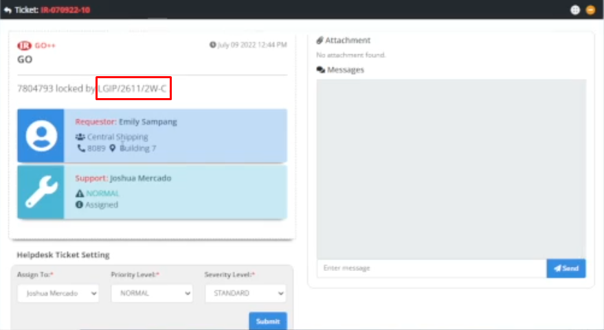
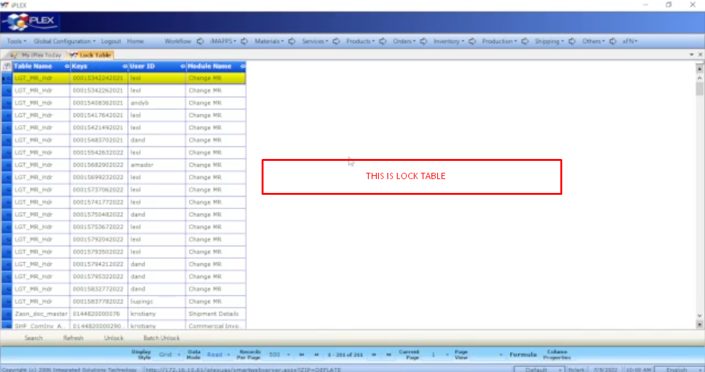
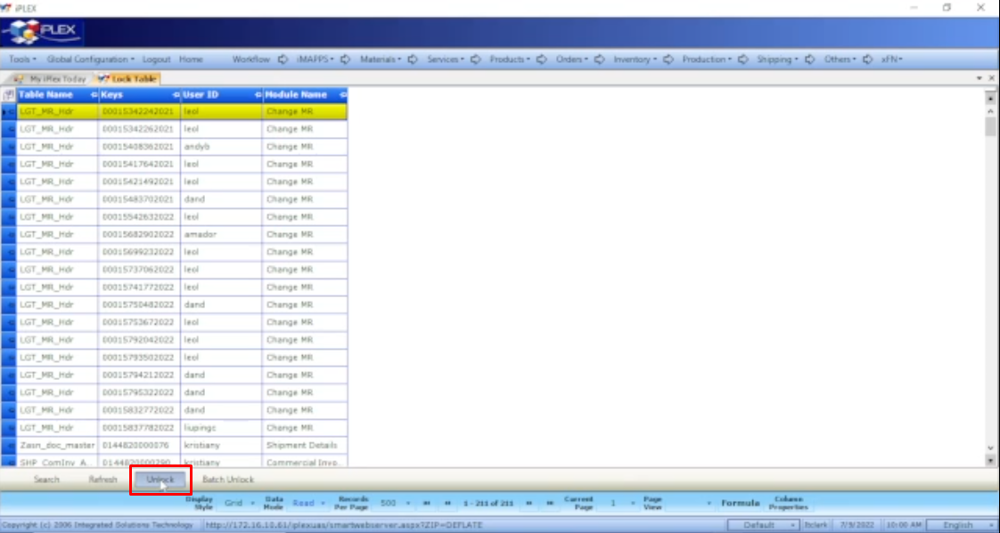
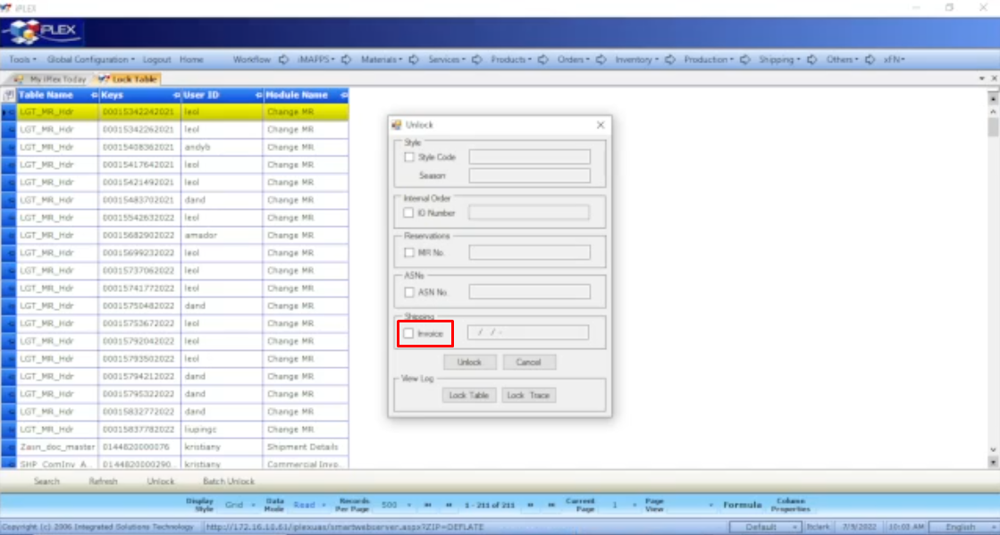
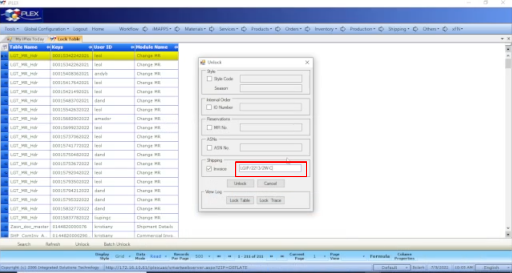
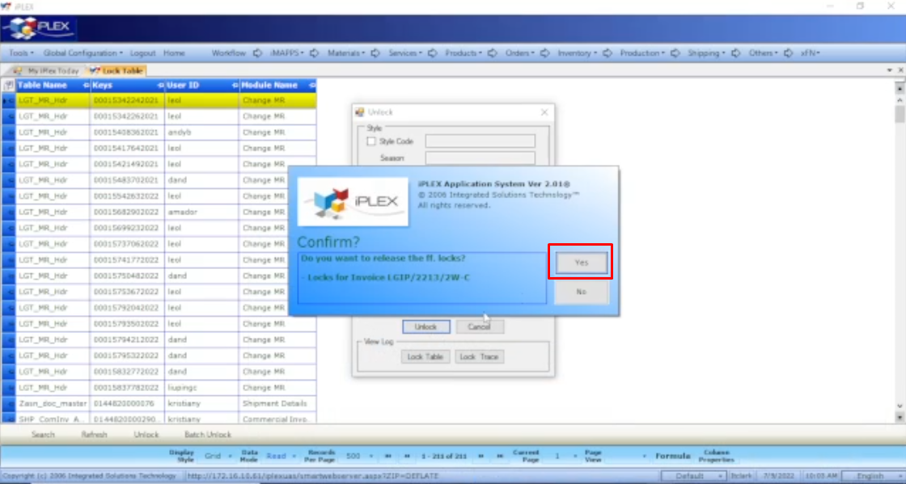
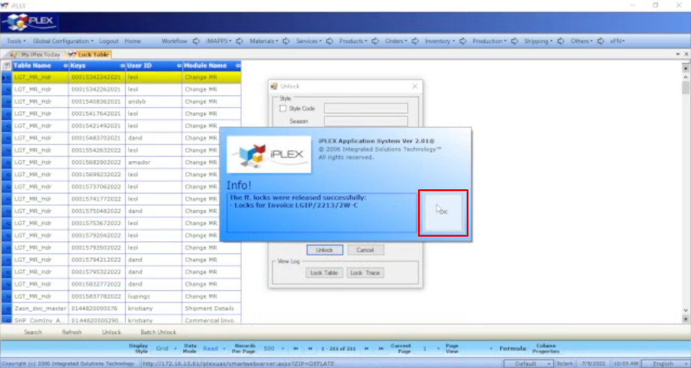

# Title: UNLOCK INVOICE
## Prerequisite:
```
The Shipping Invoice Code (e.g. LGIP/2611/2W-C) should be indicate in the Ticket description. (REQUIRED)
```

```
It's better if the requestor provided a screenshot of a pop-up error or notification in their GO+. (OPTIONAL)
```

## Problem Description:
```
The requestor wants to unlock shipping invoice.
```



## Why the Requestor asked for it?
```
N/A
```

## Possible Problem Samples:
```
N/A
```

## Solution:

1. Go to ***GO+***

2. Navigate ***Tools > Admin Tools > Locks > Locks Table***


3. Click ***Unlock***


4. An unlock pop-up will appear, tick the ***Invoice*** checkbox in the Shipping fieldset


5. Then, type the ***Invoice*** code in the input field


6. Click ***Unlock***


7. A confirmation pop-up appears. Click ***Yes***


8. An information pop-up appears. click ***Ok***


9. You're done!


## Possible New Problems and their solutions:
```
N/A
```

